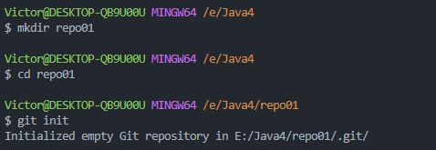
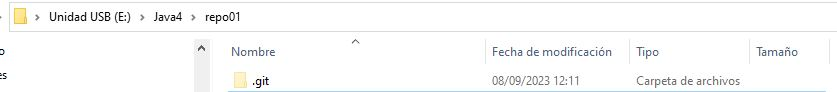
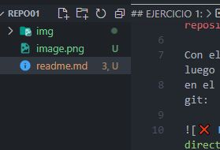

# Git #

## EJERCICIO 1: ##

### 1.1- Crea un directorio llamado repo01 en local (desde tu máquina) e ejecuta el comando pertinente para que dicho directorio para que se transforme el repositorio en local ¿Cómo podemos identificar que el repositorio se ha inicializado? ###

Con el comando mkdir "repo01" creamos el directorio, luego vamos a la ruta y con git init lo inicializamos,
en el directorio veremos que se ha creado la carpeta .git:

### 1.2 – Añade un documento llamado readme.md dentro del repositorio (recuerda que MD es la extensión de los ficheros Markdown) y documenta en su interior todos los pasos que vas realizando para crear un repositorio, etc. Puedes añadir fotos o lo que creas conveniente ###

Abrimos desde VSC el fichero y desde el lateral cremos un nuevo fichero.

### 1.2 – Añade un documento llamado readme.md dentro del repositorio (recuerda que MD es la extensión de los ficheros Markdown) y documenta en su interior todos los pasos que vas realizando para crear un repositorio, etc. Puedes añadir fotos o lo que creas conveniente ###