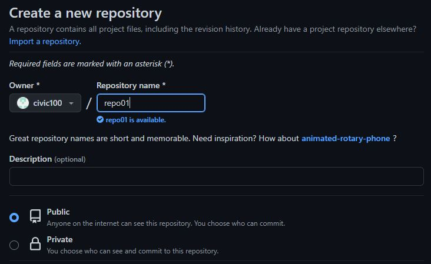

# Git #

## EJERCICIO 1: ##

### 1.1- Crea un directorio llamado repo01 en local (desde tu máquina) e ejecuta el comando pertinente para que dicho directorio para que se transforme el repositorio en local ¿Cómo podemos identificar que el repositorio se ha inicializado? ###

Con el comando mkdir "repo01" creamos el directorio, luego vamos a la ruta y con git init lo inicializamos,
en el directorio veremos que se ha creado la carpeta .git:

### 1.2 – Añade un documento llamado readme.md dentro del repositorio (recuerda que MD es la extensión de los ficheros Markdown) y documenta en su interior todos los pasos que vas realizando para crear un repositorio, etc. Puedes añadir fotos o lo que creas conveniente ###

Abrimos desde VSC el fichero y desde el lateral cremos un nuevo fichero.

### 1.3 – Añade el fichero que acabamos de añadir al repositorio al staging area, visualiza el estado del repositorio (con git status) y haz un snapshot (commit) del fichero hacía nuestro repositorio local. ¿En que “file status lifecycle” se encuentra el fichero? ###
 
Visualizar el estado del repositorio una vez añadidos al area:

Realizamos el commit (snapshot):

Y con git status comprobamos el estado de los ficheros, vemos 2 img nuevas y un fichero modificado:

### 1.4 – Intenta subir los ficheros al repositorio remoto mediante al comando git push ¿Se te ocurre que está pasando? (si no lo sabes aún no te preocupes) ###

No se puede subir los ficheros al repositorio remoto ya que este no esta enlazado a ninguno.

### 1.5 – Ejecuta el comando git remote –v e investiga porque no nos aparece nada ###

No sucede nada ya que no tenemos asociado el repositorio. 

### 1.6 – Crea un repositorio remoto llamado repo01, asócialo a tu repositorio local ###

* Nos dirigimos a la pagina web [GitHub](https://github.com/ "https://github.com") y cremos el nuevo repositorio:

* Ahora ejecutamos los siguentes 3 comandos:
  * El primero sirve para enlazar nuestro repositorio remoto.
  *  Despues renombramos la rama (branch) de master a main.
  *  Por ultimo relizamos en push.
  

### 1.7 – Vuelve a ejecutar el comando git remote –v nuevamente y explica el porque ahora si que aparece ###